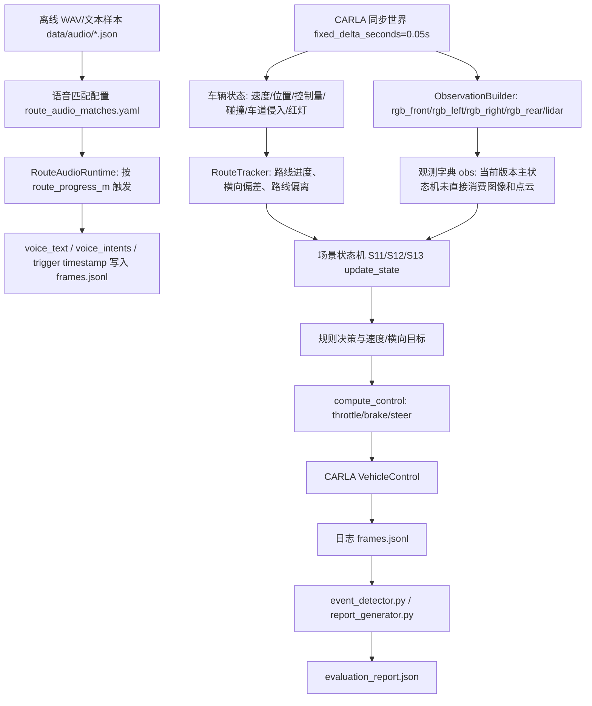
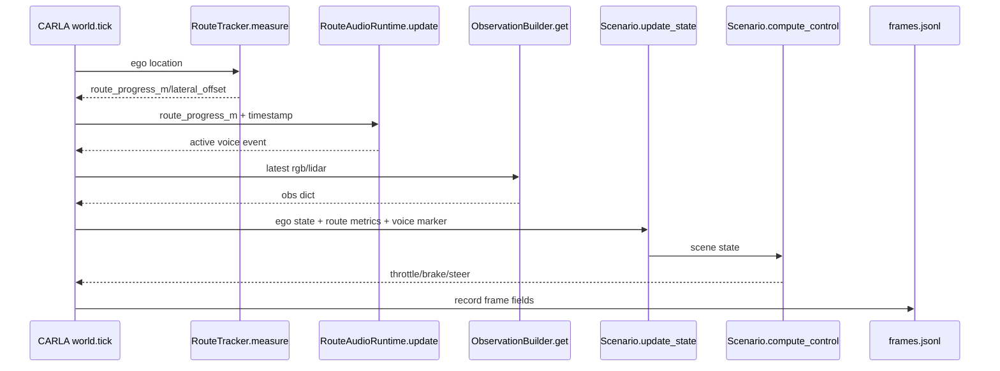
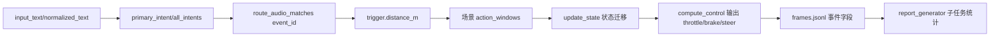
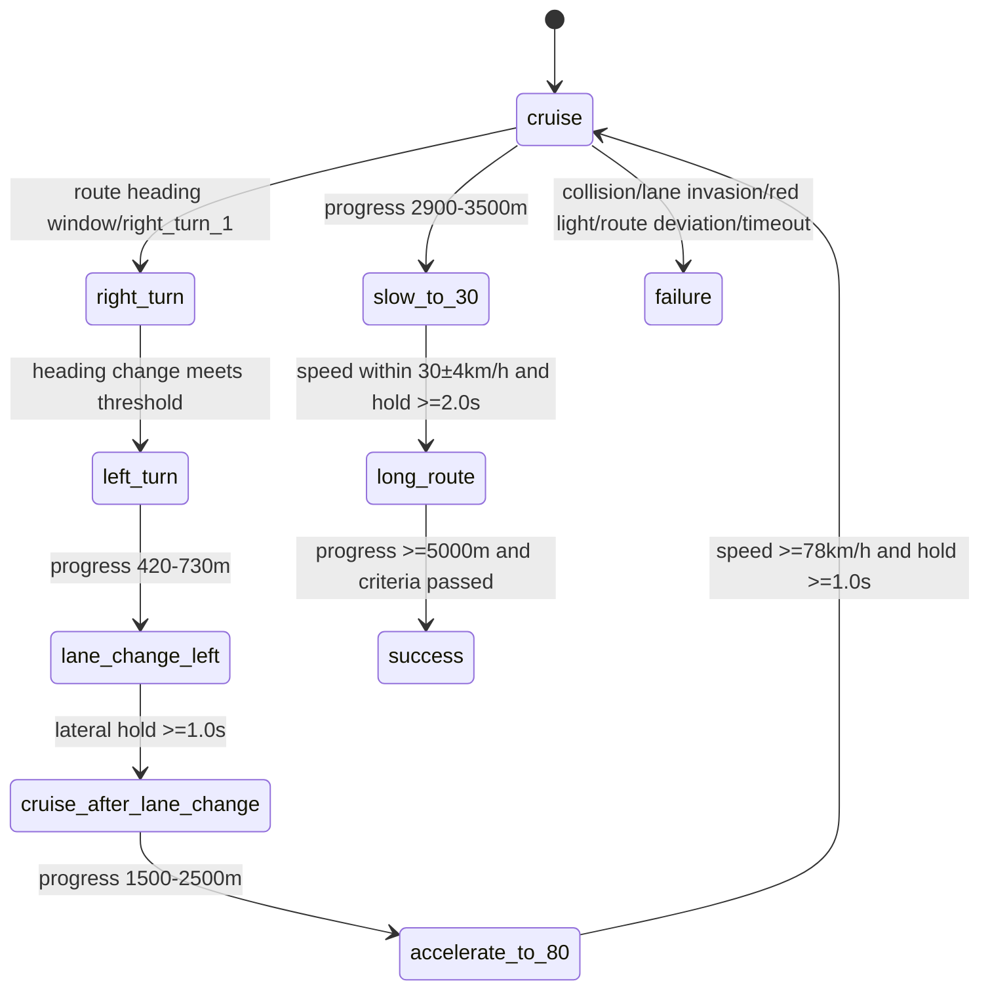
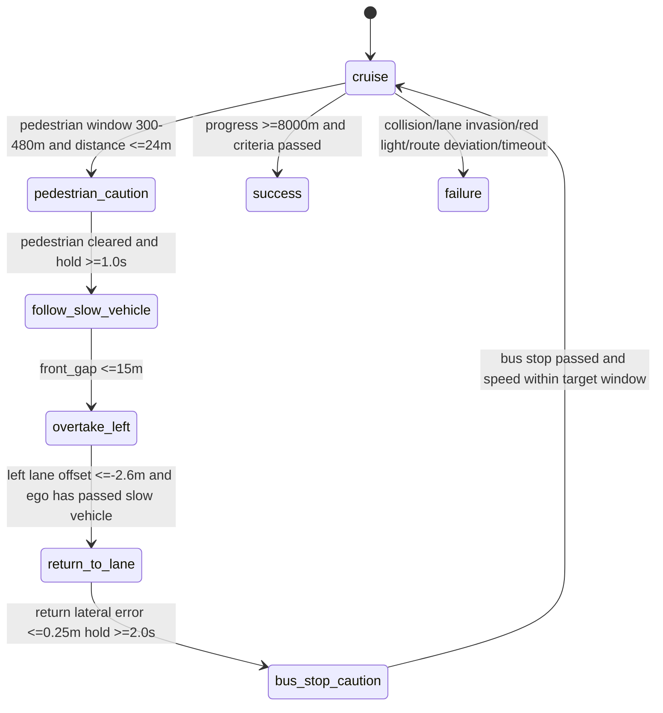
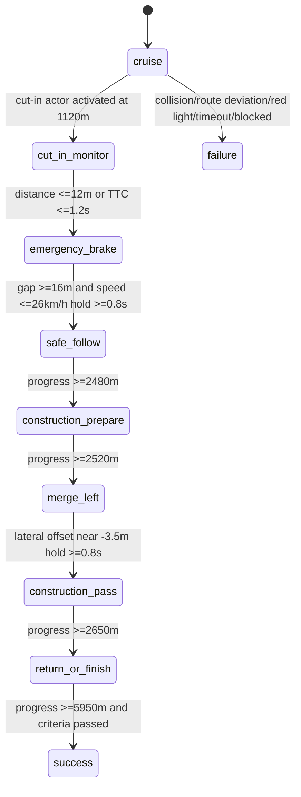
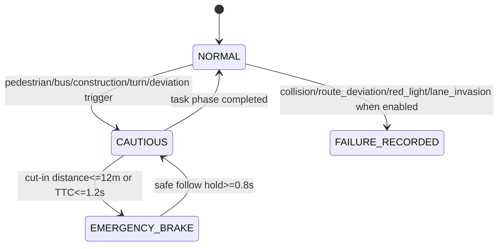

# 多模态融合与场景适配说明

**文档名称：** 多模态融合与场景适配说明  
**赛题编号：** XH-202602  
**项目名称：** 面向智能驾驶的大模型应用场景研究  
**团队名称：** 待补充  
**文档版本：** v1.0-engineering-rewrite  
**编写日期：** 2026-07-26  
**适用范围：** 基础赛道提交材料；当前版本以项目代码、配置、日志和评测脚本为依据。

## 修订记录

| 版本 | 日期 | 修改内容 | 依据 |
|---|---|---|---|
| v0.1 | 2026-07-25 | 初版说明文档 | `docs/submission/多模态融合与场景适配说明.md` |
| v1.0-engineering-rewrite | 2026-07-26 | 按真实代码重写多模态输入、语义对齐、三类场景状态机、异常处理、日志与评测映射 | `carla_eval/`、`configs/`、`logs/`、`reports/` |

## 目录

[TOC]

## 术语和缩写

| 缩写/术语 | 全称 | 本项目含义 |
|---|---|---|
| ASR | Automatic Speech Recognition，自动语音识别 | 当前仓库保留离线音频解析结果和适配接口，主评测链路未在线执行 ASR。 |
| NLU | Natural Language Understanding，自然语言理解 | 当前以离线 JSON 中的 `primary_intent`、`all_intents`、`speed_values` 表示语义结果。 |
| LiDAR | Light Detection and Ranging，激光雷达 | 通过 CARLA `sensor.lidar.ray_cast` 接入观测字典，主状态机未直接消费点云。 |
| TTC | Time To Collision，碰撞时间 | S13 突发加塞场景中按前向距离和相对速度计算。 |
| CARLA | 开源自动驾驶仿真平台 | 当前配置版本为 `0.9.10.1`。 |
| route progress | 路线进度 | `RouteTracker.measure()` 将自车世界坐标投影到路线折线后的累计距离。 |

# 1. 多模态融合总体设计

## 1.1 设计目标

本文档说明当前工程版本中语音/文本、图像、LiDAR、车辆状态、道路与天气信息如何进入 CARLA 仿真评测链路，并说明三类比赛场景中的决策逻辑、异常处理和指标统计方式。本文所有“当前版本采用”“当前日志记录”“当前场景触发”等确定性表述均以项目代码、YAML 配置或 `reports/pdf_delivery` 下评测结果为依据。

需要特别说明：当前长路线基准主流程不是在线 ASR/NLU 直接闭环控车。`carla_eval/evaluator.py` 中车辆控制由场景控制器 `update_state()` 与 `compute_control()` 执行；语音链路当前主要通过 `RouteAudioRuntime` 按路线进度触发离线语音匹配记录和可选显示窗口。`Voice2LMDriveAdapter` 已预留外部 Voice2LMDrive 命令或 mock 后端接口，但未接入当前 `run_benchmark.py` 主评测流程。

## 1.2 系统总体数据流

模块归属：`RouteAudioRuntime` 属于语音触发；`ObservationBuilder` 属于传感器接入；`RouteTracker` 和场景状态机承担当前版本的融合锚点与规则裁决；`compute_control()` 属于控制输出；`evaluator.py`、`event_detector.py`、`report_generator.py` 负责日志与指标统计。

## 1.3 决策优先级设计

当前版本没有独立的数值型多模态权重融合公式。三类场景采用规则状态机和阈值裁决。文档中的“融合”应理解为：在同一仿真时间基准和路线进度坐标下，把语音触发事件、车辆状态、路线拓扑、场景 actor 状态、交通规则和天气参数组合为状态机输入。

当前工程中可追溯的安全优先级为：碰撞与紧急制动优先于交通规则；交通规则优先于路线与车道约束；路线与车道约束优先于语音驾驶意图；舒适性和通行效率最后处理。该优先级主要体现在 `failure_criteria`、红灯/车道/碰撞日志字段、S13 紧急制动条件和各场景的保守速度控制中。

# 2. 多模态输入组成

## 2.1 语音与文本指令

当前版本的语音数据来源是离线音频样本及其 JSON 解析结果，例如 `data/audio/S11/20260715/record_04_20260715_204105.json`。这些 JSON 包含 `input_text`、`normalized_text`、`primary_intent`、`all_intents`、`confidence`、`speed_values`、`timing.t_asr_ms`、`timing.t_parse_ms`、`timing.t_total_ms` 和 `mode: offline`。`configs/lmdrive/route_audio_matches.yaml` 将这些离线语音样本绑定到场景事件和路线触发距离，统一提前量为 `voice_lead_distance_m: 40.0`。

`RouteAudioRuntime.update(route_progress_m, timestamp)` 在路线进度达到 `trigger.distance_m` 后触发一次语音事件，并把 `voice_trigger_timestamp` 和 `voice_trigger_progress_m` 写入活动事件。`evaluator.py` 运行日志真实写入字段为 `voice_audio_id`、`voice_event_id`、`voice_text`、`voice_intents`、`voice_triggered`、`voice_trigger_progress_m`、`voice_trigger_timestamp`。

当前版本未在主评测流程中实现在线 VAD、降噪、方言识别、N-best 候选裁决或实时 ASR/NLU 控制闭环。`Voice2LMDriveAdapter` 预留 `recognized_text`、`recognized_intents`、`target_speed_max_kmh`、`no_collision`、latency 等字段，但该适配器未接入当前长路线基准主流程。

## 2.2 前视及多视角图像

`ObservationBuilder.SENSOR_SPECS` 真实配置了四路 RGB 相机：`rgb_front`、`rgb_left`、`rgb_right`、`rgb_rear`。其中前视相机为 `1200x900`，FOV 为 `100`；左、右、后视相机为 `400x300`，FOV 为 `100`。相机蓝图均为 `sensor.camera.rgb`，安装在自车坐标系下的固定外参位置。

相机仅在 `ScenarioEvaluator.run(..., enable_cameras=True)` 时挂载；`run_benchmark.py` 默认启用，除非传入 `--no-cameras`。当前状态机代码没有直接读取 `rgb_front`、`rgb_left`、`rgb_right`、`rgb_rear` 字段进行目标识别，因此文档不能把相机描述为当前控制闭环中的主感知模型输入。更准确的描述是：相机观测接口已经接入，当前场景控制仍主要依赖路线、车辆状态和脚本 actor 规则。

## 2.3 LiDAR 点云

LiDAR 蓝图为 `sensor.lidar.ray_cast`，安装外参为 `x=1.3, y=0.0, z=2.5, yaw=-90.0`。回调 `_on_lidar()` 将 CARLA 原始点云解析为 `N x 4` 的 `x, y, z, intensity` 数组并写入观测字典。代码中未显式设置 LiDAR 的 `range`、`channels`、`rotation_frequency`、`points_per_second` 等属性，因此这些参数当前采用 CARLA blueprint 默认值，文档中应标记为“当前未显式配置”。

与相机类似，当前三类场景状态机未直接读取 `lidar` 字段进行障碍物分类或占据栅格融合。公交站、施工锥桶、工人和加塞车辆来自场景配置中的 CARLA actor 或 static prop，并通过路线进度、相对位置和速度阈值判断。

## 2.4 车辆状态

车辆状态由 `evaluator.py` 在每个同步 tick 采集并写入 `frames.jsonl`，字段包括 `ego_x`、`ego_y`、`ego_z`、`ego_speed_kmh`、`steer`、`throttle`、`brake`、`collision`、`collision_other_actor`、`lane_invasion`、`crossed_lane_markings`、`red_light_violation`、`active_traffic_light_state`、`route_progress_m`、`route_completion`、`lateral_offset_from_route_m`、`route_deviation` 等。

这些字段是当前状态机与评测脚本最可靠的闭环依据。例如 S11 的 `reach_target_speed_80`、`reach_target_speed_30`、`complete_lane_change_left`，S12 的 `safe_slowdown_completed`、`overtake_completed`、`return_to_lane_completed`，S13 的 `emergency_brake_started`、`merge_completed`、`safe_brake_completed` 均通过车辆状态、路线进度和场景 actor 相对关系判定。

## 2.5 环境、道路与天气信息

三类场景均使用 Town05。S11 天气为 `ClearNoon`，S12 为 `CloudySunset`，S13 为 `CustomHardRainNight`。S13 显式配置天气参数：`cloudiness=100.0`、`precipitation=60.0`、`precipitation_deposits=70.0`、`wetness=85.0`、`wind_intensity=45.0`、`fog_density=12.0`、`fog_distance=80.0`、`sun_altitude_angle=-14.0`。

S13 中存在真实天气风险分数计算 `_compute_hazard_score()`，公式为 `0.35*precipitation + 0.20*fog_density + 0.25*night + 0.20*wetness` 的归一化风险分数并限制到 `1.0`。但当前 S13 配置中 `danger_zone.enabled: false`，因此危险路段降速子逻辑没有在本次报告中形成完整触发结果，后续文档应避免把该分支写成当前已通过的任务。

## 2.6 输入接口与数据字段汇总

| 模态 | 实际来源 | 更新方式/频率 | 时间戳来源 | 坐标系 | 主要字段 | 对应代码 |
|---|---|---|---|---|---|---|
| 语音/文本 | `data/audio/*.json` + `route_audio_matches.yaml` | 按路线触发距离一次触发；全局提前量 `40.0m` | `timestamp = frame * 0.05` | 路线进度锚点 | `input_text`、`normalized_text`、`primary_intent`、`all_intents`、`confidence`、`voice_trigger_timestamp` | `route_audio_runtime.py`、`evaluator.py` |
| 前视图像 | CARLA `sensor.camera.rgb` | 同步 tick 下最新帧；未设置 `sensor_tick` | CARLA sensor 回调；主日志未单独记录 sensor timestamp | 相机坐标/图像坐标 | `rgb_front`，`1200x900`，FOV `100` | `observation_builder.py` |
| 左右/后视图像 | CARLA `sensor.camera.rgb` | 同步 tick 下最新帧；未设置 `sensor_tick` | CARLA sensor 回调；主日志未单独记录 sensor timestamp | 相机坐标/图像坐标 | `rgb_left/right/rear`，`400x300`，FOV `100` | `observation_builder.py` |
| LiDAR | CARLA `sensor.lidar.ray_cast` | 同步 tick 下最新点云；未设置 `sensor_tick` | CARLA sensor 回调；主日志未单独记录 sensor timestamp | LiDAR 传感器坐标 | `N x 4` 点云：`x,y,z,intensity` | `observation_builder.py` |
| 车辆状态 | CARLA ego actor、碰撞传感器、车道侵入传感器、红灯 tracker | 每帧 20 Hz | `timestamp = frame * dt` | CARLA 世界坐标 + 路线坐标 | 速度、控制量、碰撞、车道侵入、红灯、路线进度、横向偏差 | `evaluator.py`、`runtime_metrics.py` |
| 环境与天气 | YAML 配置、CARLA 地图、场景 actor | 场景初始化时配置，部分 actor 每帧更新 | 同步仿真时间 | CARLA 世界坐标 + route progress | 天气、路线、交通灯、动作窗口、actor stage | `configs/scenarios/*.yaml`、`scenarios_impl/*.py` |

# 3. 多模态时空与语义对齐方法

## 3.1 时间对齐

CARLA 世界在 `evaluator.py` 中设置 `settings.synchronous_mode = True`，`settings.fixed_delta_seconds = dt`。三类场景 YAML 均配置 `fixed_delta_seconds: 0.05`，对应 20 Hz 仿真步长。主循环时间戳由 `timestamp = frame * dt` 计算。

图像和 LiDAR 由 `ObservationBuilder` 的回调写入 `_latest`，`get()` 非阻塞返回最新观测。代码没有实现“最大跨模态时间差阈值”，也没有对过期 sensor frame 做显式丢弃。内部队列 `Queue(maxsize=2)` 存在，但当前 `get()` 读取的是 `_latest`，不是滑动窗口融合结果。

语音触发时间由 `RouteAudioRuntime.update()` 在路线进度达到 `trigger.distance_m` 的同步帧写入。当前未实现语音指令有效期和超时清除；`_active` 事件会保持到下一条语音事件触发。

## 3.2 坐标和空间对齐

`RouteTracker.measure()` 将自车世界坐标投影到路线折线段，输出 `route_progress_m`、`max_route_progress_m`、`route_total_length_m`、`route_completion`、`lateral_offset_from_route_m`、`route_distance_to_centerline_m`、`on_driving_lane` 和 `route_deviation`。为避免路线自交或重复段跳变，投影搜索优先落在 `last_progress_m - 20.0m` 到 `last_progress_m + 80.0m` 的连续窗口内。

路线偏离判定条件为：不在 driving lane，或 `abs(lateral_offset_from_route_m) > route_corridor_half_width_m`，或进度小于 `-2.0m`。三类场景的 `route_corridor_half_width_m` 分别为 S11 `8.0m`、S12 `8.5m`、S13 `9.0m`。

## 3.3 语音语义结构化

当前可追溯的结构化语义字段来自离线音频 JSON 与匹配配置，而不是在线统一 semantic object。

| 字段 | 类型 | 含义 | 示例 | 来源模块 |
|---|---|---|---|---|
| `input_text` | string | 原始或人工校正前文本 | `向右转弯。` | `data/audio/*.json` |
| `corrected_text` | string | 离线修正文案 | `施工路段减速并道至左侧车道。` | `data/audio/*.json` |
| `normalized_text` | string | 离线归一化文本 | `施工路段减速并道至左侧车道` | `data/audio/*.json` |
| `primary_intent` | string | 主意图 | `TURN_RIGHT` | `data/audio/*.json` |
| `all_intents` | list | 离线解析出的意图集合 | `LANE_CHANGE_LEFT, AVOID_CONSTRUCTION, SLOW_DOWN` | `data/audio/*.json` |
| `confidence` | float | 离线样本置信度 | `0.8` | `data/audio/*.json` |
| `speed_values` | list | 文本中抽取出的速度槽位 | `30.0 km/h` | `data/audio/*.json` |
| `event_id` | string | 匹配到的场景事件 | `bus_stop_caution` | `route_audio_matches.yaml` |
| `trigger.distance_m` | float | 路线触发距离 | `1720.0` | `route_audio_matches.yaml` |
| `expected.target_speed_kmh` | float/null | 场景期望速度 | `30.0` | `route_audio_matches.yaml` |

适配器预留字段 `recognized_text`、`recognized_intents`、`target_speed_max_kmh`、`no_collision` 只在 `Voice2LMDriveAdapter` 和 metric schema 中存在，当前主运行日志未完整使用。`urgency_level` 未在代码或配置中找到，后续文档不再使用该字段。

## 3.4 语义到驾驶子任务的映射

语义到行为的当前实现分为两层：离线语音样本通过 `route_audio_matches.yaml` 绑定到 `event_id` 和触发距离；场景 YAML 的 `instructions.expected_subtasks` 定义评测期望子任务。`report_generator.infer_subtask_metrics()` 根据事件名映射计算 `subtask_missing_rate` 和 `action_success_rate`。

三个真实解析示例：

| 类型 | 原始指令 | 离线解析结果 | 场景事件 | 当前运行处理 |
|---|---|---|---|---|
| 单步基础指令 | `向右转弯。` | `primary_intent=TURN_RIGHT`，`confidence=0.95` | `right_turn_1`，触发距离 `55.0m` | 语音触发日志记录；右转控制由 S11 路线窗口和状态机执行 |
| 复杂组合指令 | `前方公交站有行人上下车，注意减速到30公里每小时，确认安全后继续行驶。` | `BUS_STOP_CAUTION, PEDESTRIAN_CAUTION, SLOW_DOWN`，速度槽位 `30.0km/h`，`confidence=0.8` | `bus_stop_caution`，触发距离 `1720.0m` | S12 按公交站窗口和 `bus_stop_target_speed_kmh=30.0` 执行 |
| 模糊应急指令 | `前方路况危险，保持安全车速。` | `primary_intent=SLOW_DOWN`，`confidence=1.0` | `dangerous_road_safety_speed`，触发距离 `0.0m` | 当前 S13 `danger_zone.enabled=false`，不应写成已完成危险路段降速闭环 |

## 3.5 多模态冲突裁决

当前代码中没有图像与 LiDAR 数值冲突矩阵，也没有 `confidence` 到模态权重的公式。实际裁决主要是规则优先级：碰撞、TTC、前向距离、车道侵入、红灯、路线偏离等安全字段优先；语音事件只作为触发/展示与场景锚点说明，不覆盖状态机安全条件。

可写入文档的当前规则包括：当 `collision` 为 true 时评测失败；当 `route_deviation` 为 true 且对应失败项启用时评测失败；S13 中当加塞车前向距离不超过 `12.0m` 或 TTC 不超过 `1.2s` 时触发紧急制动；S12 中行人未安全通过时强制制动；S11/S12 中红灯违规由 `RedLightViolationTracker` 记录并纳入失败统计。

## 3.6 模态权重或优先级调整机制

本文档后续统一将原“动态权重调整”改写为“基于场景条件、阈值和安全优先级的多模态/多信息源冲突裁决机制”。当前版本没有可追溯的视觉权重、LiDAR 权重、天气权重归一化公式。S13 的天气风险分数是真实存在的环境风险指标，但不等同于多模态感知权重。

## 3.7 多模态语义对齐精度定义

当前 `configs/metrics/metric_schema.yaml` 预留 `recognized_text`、`recognized_intents`、`expected_intents`、`intent_match`、`voice_target_speed_max_kmh` 等字段，但主日志未完整写入这些字段，`report_generator.py` 也未实现官方“多模态语义对齐精度”的完整计算。因此当前版本不能声称已按代码统计达到 98%。

建议评测方法如下，需在后续脚本中实现后才能作为正式结果：对每条语音样本计算动作类型、目标对象、目标速度、目标车道/方向、空间锚点、约束条件、子任务顺序、触发时机、感知目标匹配和最终行为一致性。单条样本全部满足计 1 分；组合指令按子任务拆分计分；缺失关键安全约束或错误触发高风险动作计 0 分；非关键槽位缺失可按部分正确记录但不计入“完全正确数”。

建议公式：`多模态语义对齐精度 = 完全正确样本数 / 有效样本总数 * 100%`。当前可作为样本来源的离线匹配语音共有 11 条，其中 S11 5 条、S12 3 条、S13 3 条；人工标注真值和自动计算脚本仍待补充。

# 4. 噪声、模糊指令与低置信度输入鲁棒性

## 4.1 语音噪声处理

当前仓库只保存离线处理后的音频 JSON 结果，未找到可追溯的在线降噪、语音活动检测、静音切分实现。文档应描述为“当前版本使用离线音频结果进行场景绑定；实时噪声处理为后续扩展接口”。离线 JSON 中有 `corrected_text`、`normalized_text` 和 `timing`，但不能据此声称主评测流程已在线执行降噪。

## 4.2 同义表达与模糊指令归一化

离线样本中存在一定表达归一化结果，例如 `施工路段减速并倒致左侧车道。` 的 `corrected_text` 为 `施工路段减速并道至左侧车道。`，`normalized_text` 为 `施工路段减速并道至左侧车道`。但同义词库或在线规则表未在当前仓库中找到，因此文档只能写为“离线样本包含归一化结果”，不能写成“系统在线支持完整同义词映射”。

## 4.3 低置信度指令处理

当前 11 条离线样本的 `confidence` 范围为 `0.8` 到 `1.0`，平均约 `0.886`。未找到运行时置信度阈值、二次确认阈值或低置信度拒识策略。`low_confidence_intents` 字段在样本中存在但均为空。后续文档应将“低置信度处理”标为预留能力或建议扩展，不写成当前闭环已实现。

## 4.4 指令与场景不匹配处理

当前不匹配处理主要体现在 `route_audio_matches.yaml` 的离线匹配阶段：每条语音样本与 `scenario_id`、`event_id`、触发距离绑定。运行时 `RouteAudioRuntime` 只加载 `status: matched` 且场景 ID 匹配的条目。若没有匹配项，语音触发不会进入运行日志，车辆仍由场景默认指令和状态机控制。

## 4.5 高风险指令的二次安全校验

当前高风险动作不会由语音直接下发为控制量。变道、超车、紧急制动和施工并道均由场景状态机基于路线进度、前向距离、TTC、横向偏差、速度等条件触发。例如 S13 只有在加塞车进入距离/TTC 风险条件时才触发 `emergency_brake_started`；S12 超车需要慢车被检测、前向 gap 达到触发阈值并完成左车道偏移后才标记成功。

# 5. 基础操控场景适配

## 5.1 场景环境和任务目标

S11 配置文件为 `configs/scenarios/basic_control/S11_basic_control_scene1_5km.yaml`。场景为 Town05、`ClearNoon`、目标路线长度不低于 `5000.0m`，交通灯模式为 `preserve`，红灯违规由评测层记录。巡航速度为 `50.0km/h`，包含真实路口左/右转、左变道、提速至 `80.0km/h`、减速至 `30.0km/h`。

## 5.2 支持的语音指令

S11 离线匹配语音共有 5 条：加速到 80、左转、减速、右转、左变道。触发距离分别为 `1460.0m`、`145.0m`、`2860.0m`、`55.0m`、`380.0m`。当前运行日志中至少可见 `right_turn_1` 在 `timestamp=6.95s`、`route_progress=55.35m` 触发，`voice_text=向右转弯。`，`voice_intents=[TURN_RIGHT]`。

## 5.3 决策状态机

## 5.4 保持车道

保持车道由 `RouteTracker.point_at_progress_smoothed()` 生成前视目标点，控制参数包括 `lookahead_m=12.0`、`steer_gain=1.25`、`max_steer=0.46`。路线偏离阈值由 `route_corridor_half_width_m=8.0` 给出。若红灯、车道侵入或路线偏离被记录，按 `failure_criteria` 进入失败统计。

## 5.5 加速与减速

加速窗口为 `1500.0m` 到 `2500.0m`，目标速度 `80.0km/h`，控制目标速度 `95.0km/h`，达到判定速度 `min_reached_speed_kmh=78.0`，容差 `7.0km/h`，需要保持 `1.0s`。减速窗口为 `2900.0m` 到 `3500.0m`，目标速度 `30.0km/h`，容差 `4.0km/h`，需要保持 `2.0s`。

## 5.6 左右转向

S11 支持自动从路线航向变化扫描转弯窗口。扫描参数包括 `turn_scan_step_m=8.0`、`turn_scan_span_m=50.0`、`turn_threshold_deg=35.0`、`turn_min_gap_m=70.0`、`turn_window_half_width_m=55.0`。配置中显式右转窗口 `95.0-185.0m`、左转窗口 `185.0-305.0m`，目标速度分别为 `28.0km/h` 和 `30.0km/h`。

## 5.7 变道

左变道窗口为 `420.0m` 到 `730.0m`，目标速度 `45.0km/h`，完成判定为 `completion_lateral_offset_m=0.8` 并保持 `1.0s`。路线配置中 `lateral_offset_profile` 在 `450.0m` 到 `650.0m` 将路线横向偏移从 `0.0m` 平滑切到 `-3.5m`，并设置 `hold_after: true`。

## 5.8 异常处理

S11 不存在独立的最小风险停车状态机。当前异常处理由失败条件和控制限幅构成：碰撞、路线偏离、车道侵入、红灯、阻塞、超时均可触发失败；当 `abs(steer)>0.35` 时，速度控制会将 throttle 限制到不超过 `0.45`。

## 5.9 决策表与验证结果

| 状态/阶段 | 触发条件 | 判断依据 | 决策动作 | 完成条件 | 异常处理 |
|---|---|---|---|---|---|
| `cruise` | 默认阶段 | `route_progress_m`、路线目标点 | 50km/h 跟踪路线 | 进入动作窗口 | route deviation/红灯/车道侵入进入失败统计 |
| `right_turn/left_turn` | 航向窗口或配置窗口 | 路线航向变化、进度窗口 | 限速 28/30km/h，缩短 lookahead | 航向变化达到阈值 | 未完成则子任务缺失 |
| `lane_change_left` | 420-730m | 横向偏移、保持时间 | 跟踪左变道路线 | lateral offset 达标并保持 1.0s | 车道侵入或路线偏离失败 |
| `accelerate_to_80` | 1500-2500m | 车速、保持时间 | 控制目标 95km/h | 速度 >=78km/h 保持 1.0s | 超窗未完成则子任务缺失 |
| `slow_to_30` | 2900-3500m | 车速、保持时间 | 目标 30km/h | 30±4km/h 保持 2.0s | 超窗未完成则子任务缺失 |

| 场景 | 测试次数 | 成功次数 | 任务完成率 | 碰撞次数 | 违规次数 | 平均响应延时 | P95 延时 | 当前失败原因 |
|---|---:|---:|---:|---:|---:|---:|---:|---|
| S11 基础操控 | 1 | 0 | 0.0% | 0 | 29 | 待补充 | 待补充 | `route_deviation`；`lane_invasion_count=26`，`route_deviation_count=3` |

# 6. 复杂避障场景适配

## 6.1 场景环境和任务目标

S12 配置文件为 `configs/scenarios/complex_obstacle/S12_complex_obstacle_scene2_8km.yaml`。场景为 Town05、`CloudySunset`，目标路线进度 `8000.0m`，任务链为行人避让、慢车左变道超越、返回原车道、公交站减速谨慎通过、安全通过并恢复巡航。

## 6.2 组合语音指令拆解

S12 有 3 条离线语音：行人横穿减速刹车、慢车超越、公交站减速到 30 并继续。匹配事件分别为 `pedestrian_crossing`、`slow_vehicle_overtake`、`bus_stop_caution`，触发距离为 `280.0m`、`1090.0m`、`1720.0m`。

## 6.3 状态转移图

## 6.4 行人横穿避让

行人窗口为 `300.0m` 到 `480.0m`，锚点 `360.0m`，横穿持续 `5.2s`。成功判定配置包括 `pedestrian_detection_distance_m=24.0`、`pedestrian_min_safe_distance_m=4.5`、`pedestrian_required_hold_seconds=1.0`、`pedestrian_validation_span_m=28.0`。当行人进入检测距离且位于窗口内，状态机设置 `pedestrian_detected` 和 `ped_slowdown_started`；控制层在未完成安全减速前可输出 `brake=0.95` 或 `0.65`。

## 6.5 慢车超越

慢车速度配置为 `20.0km/h`，检测 gap 阈值 `overtake_detection_gap_m=30.0`，变道触发 gap `lane_change_trigger_gap_m=15.0`。超车阶段目标速度 `50.0km/h`，左侧目标横向偏移 `-3.5m`，左车道就绪阈值 `overtake_left_lane_ready_offset_m=-2.6`。返回原车道条件为横向偏差不超过 `return_lane_tolerance_m=0.25` 并保持 `return_required_hold_seconds=2.0`。

当前版本没有真实后视图像或 LiDAR 后方快速来车检测逻辑；`ambient_left_001` 和 `ambient_right_001` 是场景脚本车辆，超车判定主要依赖 route progress、慢车 gap、横向偏移和速度关系。

## 6.6 公交站区域谨慎通行

公交站窗口为 `1760.0m` 到 `1980.0m`，锚点 `1850.0m`。目标速度 `bus_stop_target_speed_kmh=30.0`，速度容差 `4.0km/h`，要求保持 `2.0s`。公交车、站台标志和上下车行人为配置 actor 或 static prop；当前版本不是通过视觉模型实时检测公交站，而是依据场景锚点和 actor 阶段逻辑判断。

## 6.7 多子任务串行执行与中断恢复

S12 状态机按行人、慢车、返回车道、公交站的顺序推进。若前一任务未完成，后续 actor 的激活和控制阶段会受到限制。例如慢车 actor 在 `safe_slowdown_completed` 后才进入激活逻辑。当前没有独立的“组合指令部分识别失败恢复模块”，组合关系主要通过场景固定任务顺序保证。

## 6.8 异常处理

S12 的失败条件包括碰撞、路线偏离、红灯、车道侵入、超时和阻塞。当前报告显示所有子任务事件均完成，但由于 `lane_invasion_count=10`，最终 `success=false`。因此后续文档应把 S12 描述为“子任务链路可复现，但当前报告仍存在车道侵入失败”。

## 6.9 决策表与验证结果

| 状态/阶段 | 触发条件 | 多信息源判断依据 | 决策动作 | 完成条件 | 异常处理 |
|---|---|---|---|---|---|
| `pedestrian_caution` | 300-480m 且行人距离 <=24m | 行人 actor 位置、路线进度、自车速度 | 制动减速 | 行人清空、安全距离 >=4.5m、保持 1.0s | 未清空则继续制动 |
| `follow_slow_vehicle` | 行人避让完成且慢车激活 | front_gap、慢车速度 20km/h | 跟车限速 30km/h | gap <=15m 进入变道 | gap <=14m 时制动 |
| `overtake_left` | front_gap <=15m | 横向偏移 <=-2.6m、自车快于慢车 | 左变道超车 | front_gap <0 且速度满足 | 车道侵入进入失败统计 |
| `return_to_lane` | 超车完成 | 横向偏差 <=0.25m | 返回原车道 | 保持 2.0s | 未回正则保持回正控制 |
| `bus_stop_caution` | 接近 1850m 锚点 | 公交站 actor、行人 actor、速度 | 限速 30km/h | 通过公交站并保持速度 | 遮挡/异常未单独实现，按规则慢行 |

| 场景 | 测试次数 | 成功次数 | 任务完成率 | 碰撞次数 | 违规次数 | 平均响应延时 | P95 延时 | 当前失败原因 |
|---|---:|---:|---:|---:|---:|---:|---:|---|
| S12 复杂避障 | 1 | 0 | 0.0% | 0 | 10 | 0.0ms | 待补充 | `lane_invasion`；子任务 `action_success_rate=1.0` |

# 7. 极限应急场景适配

## 7.1 雨夜及低能见度环境

S13 配置文件为 `configs/scenarios/emergency_response/S13_extreme_emergency_scene3_6km.yaml`。天气为 `CustomHardRainNight`，目标路线进度 `5950.0m`，目标完成率 `0.99`。核心任务包括突发车辆加塞紧急制动、施工锥桶区域减速并道至左侧车道、通过施工区并完成 6km 连续驾驶。

## 7.2 状态转移图

## 7.3 突发车辆加塞

加塞车配置为 `vehicle.audi.etron`，初始进度 `1260.0m`、初始横向偏移 `-3.5m`、目标横向偏移 `0.0m`。加塞逻辑在 ego 进度 `1120.0m` 激活，merge delay `0.6s`，merge duration `2.8s`。检测距离阈值 `cut_in_detection_distance_m=70.0`，横向距离阈值在代码中为 `abs(lateral_dist)<=5.0`。

## 7.4 紧急制动与避让

S13 按 `ttc_s = forward_dist / rel_speed` 计算 TTC，其中 `rel_speed = max((ego_speed - npc_speed)/3.6, 0.0)`。当加塞车处于 `merge` 或 `accelerate` 阶段，并且前向距离不超过 `emergency_brake_distance_m=12.0`，或 TTC 不超过 `emergency_brake_ttc_s=1.2`，状态机触发 `emergency_brake_started`。安全跟车完成条件为 `forward_dist >=16.0m`、横向偏移不超过 `0.8m`、速度不超过 `25.0+1.0km/h` 并保持 `0.8s`。

## 7.5 施工路段减速并道

施工区检测进度 `2480.0m`，并道起点 `2520.0m`，并道距离 `35.0m`，施工区结束 `2650.0m`，回正结束 `2700.0m`。锥桶从 `2545.0m` 到 `2615.0m`，横向偏移从 `0.2m` 到 `2.0m`；施工工人起点 `2545.0m`，横向偏移 `2.3m`，速度 `1.4m/s`。并道目标横向偏移 `-3.5m`，容差 `0.9m`，保持 `0.8s` 判定 `merge_completed`。

当前版本施工工人和锥桶来自场景配置 actor/static prop，不是视觉或 LiDAR 模型检测输出；工人“检测”由 worker actor 相对位置和距离阈值判断，不应写成感知模型持续跟踪。

## 7.6 低置信度感知处理

当前没有图像检测置信度、LiDAR 置信度或模态失效超时时间的实现。S13 中可追溯的保守控制包括：`turn_target_speed_kmh=26.0`、`deviation_recovery_trigger_m=1.0` 时限速 `22.0km/h`、`emergency_max_steer=0.28`、`large_steer_threshold=0.3` 时 throttle 限制到 `0.18`。这些是控制限幅，不是湿滑路面动力学模型。

## 7.7 异常处理

S13 失败条件包括碰撞、路线偏离、红灯、超时和阻塞；`lane_invasion` 在配置中为 `false`，因此不会作为失败条件，但仍在报告中统计。当前报告显示 `collision_count=0`，但 `route_deviation_count=3`，`lane_invasion_count=32`，最终失败原因为 `route_deviation`。

## 7.8 决策表与验证结果

| 状态/阶段 | 触发条件 | 多信息源判断依据 | 决策动作 | 完成条件 | 异常处理 |
|---|---|---|---|---|---|
| `cut_in_monitor` | ego progress >=1120m | cut-in actor 前向距离、横向距离、速度 | 监控/保持巡航 | 距离 <=70m 标记检测 | actor spawn 失败写入 `cut_in_spawn_failed` |
| `emergency_brake` | distance <=12m 或 TTC <=1.2s | TTC、front_gap、自车速度 | 制动，限转向 `0.28` | gap >=16m、速度 <=26km/h、保持 0.8s | 未达成则 `brake_reaction_success=false` |
| `construction_prepare` | progress >=2480m | 施工区锚点、锥桶和工人配置 | 限速 30km/h | progress >=2520m | 路线偏离进入失败统计 |
| `merge_left` | progress >=2520m | 横向偏移、目标 lane offset | 并道到 -3.5m | 偏差 <=0.9m 保持 0.8s | 无法并道时继续保守控制，未见等待状态机 |
| `construction_pass` | merge completed | progress、工人距离、施工区终点 | 通过施工区 | progress >=2650m | worker 近距离触发制动标志 |

| 场景 | 测试次数 | 成功次数 | 任务完成率 | 碰撞次数 | 违规次数 | 平均响应延时 | P95 延时 | 当前失败原因 |
|---|---:|---:|---:|---:|---:|---:|---:|---|
| S13 极限应急 | 1 | 0 | 0.0% | 0 | 35 | 550.0ms | 待补充 | `route_deviation`；应急响应高于 120ms 配置目标 |

# 8. 异常处理与安全兜底

## 8.1 当前安全状态抽象

当前代码没有独立的 `NORMAL / CAUTIOUS / MINIMUM_RISK / SAFE_STOP / RECOVERY` 安全状态机类。为便于文档表达，可以将现有规则抽象为下表，但必须标注为“当前版本的简化安全状态抽象”，而不是新增代码实现。

| 抽象状态 | 进入条件 | 控制策略 | 速度上限 | 是否允许变道 | 是否允许恢复 | 退出条件 | 代码依据 |
|---|---|---|---|---|---|---|---|
| `NORMAL` | 默认巡航 | 路线目标点跟踪 | S11/S12/S13 巡航 50km/h | 按场景窗口 | 是 | 进入动作窗口或异常 | `compute_control()` |
| `CAUTIOUS` | 转弯、行人、公交站、施工、偏离恢复 | 缩短 lookahead、限速、增大制动 | S11 转弯 28/30；S12 公交 30；S13 施工 30/转弯 26/偏离 22 | 仅场景允许时 | 是 | 子任务完成 | 各场景 `update_state()` |
| `EMERGENCY_BRAKE` | S13 加塞距离/TTC 条件 | 制动优先，`emergency_max_steer=0.28` | 目标安全跟车 25km/h | 否 | 是 | 安全跟车保持 0.8s | S13 `update_state()` |
| `FAILURE_RECORDED` | 评测失败条件触发 | 日志记录，不是控制状态 | 不适用 | 不适用 | 不适用 | 报告统计 | `event_detector.py` |

## 8.2 异常类型覆盖

| 异常类型 | 当前实现状态 | 处理方式 |
|---|---|---|
| ASR 识别失败 | 未接入在线 ASR；离线样本存在 | 改为扩展接口 |
| NLU 意图冲突 | 未见运行时冲突裁决 | 改为扩展接口 |
| 槽位缺失 | 当前多数速度槽位来自配置而非在线槽位 | 改为简化实现 |
| 指令低置信度 | 未见阈值 | 改为扩展接口 |
| 指令与场景不匹配 | `RouteAudioRuntime` 只加载 matched 且 scenario 匹配项 | 保留 |
| 图像检测低置信度 | 未实现检测模型 | 删除或扩展接口 |
| LiDAR 数据过期或失效 | 未见超时逻辑 | 改为扩展接口 |
| 图像和点云冲突 | 未见冲突矩阵 | 删除或扩展接口 |
| 车辆速度不按预期下降 | 部分通过 hold time 和事件缺失体现 | 改为简化实现 |
| 制动响应滞后 | S13 有 `emergency_response_time_s` | 保留 |
| 横向偏差过大 | `route_deviation`、`lateral_offset_from_route_m` | 保留 |
| 路线偏离 | `RouteTracker.measure()` | 保留 |
| 车辆阻塞 | `failure_criteria.blocked` 配置存在，具体检测待核查 | 待补充 |
| 场景任务超时 | `max_duration_seconds` | 保留 |
| 控制节点异常 | 未见独立控制节点健康检查 | 改为扩展接口 |
| 传感器数据缺失 | 未见 sensor 超时检测 | 改为扩展接口 |

## 8.3 全链路日志记录

当前每帧日志由 `evaluator.py` 写入 `frames.jsonl`。基础字段覆盖自车状态、控制量、碰撞、车道侵入、红灯、路线进度、横向偏差、语音触发字段和延时字段。场景特有字段由各场景 `extra_record()` 增补。`event_detector.py` 从帧日志抽取事件，`report_generator.py` 生成 `evaluation_report.json` 和 CSV。

需要注意：`metric_schema.yaml` 中定义的 `recognized_text`、`intent_match`、`voice_target_speed_max_kmh` 等字段是指标 schema 预留，但当前 `evaluator.py` 实际写入的是 `voice_text` 和 `voice_intents`，因此报告中这些字段多为 `null`。

# 9. 代码实现与接口映射

| 功能 | 输入 | 输出 | 代码文件 | 类/函数 | 配置文件 | 日志字段 |
|---|---|---|---|---|---|---|
| 语音触发 | route progress、匹配 YAML | active voice event | `carla_eval/lmdrive/route_audio_runtime.py` | `RouteAudioRuntime.update()` | `configs/lmdrive/route_audio_matches.yaml` | `voice_*` |
| 语音适配接口 | 外部命令或 mock | `recognized_text/intents` 等 | `carla_eval/lmdrive/voice2lmdrive_adapter.py` | `Voice2LMDriveAdapter.run()` | 待接入 | 当前主日志未用 |
| 传感器接入 | CARLA ego actor | `rgb_*`、`lidar` | `carla_eval/sensors/observation_builder.py` | `ObservationBuilder` | `enable_cameras` | 当前未逐帧写 sensor 字段 |
| 时间对齐 | frame、dt | `timestamp` | `carla_eval/evaluator.py` | `ScenarioEvaluator.run()` | `fixed_delta_seconds=0.05` | `timestamp/frame` |
| 空间对齐 | ego location、route points | route metrics | `carla_eval/runtime_metrics.py` | `RouteTracker.measure()` | `route_corridor_half_width_m` | `route_progress_m`、`lateral_offset_from_route_m` |
| 风险评估 | 距离、TTC、交通规则 | 场景状态/失败事件 | `scenarios_impl/*.py`、`event_detector.py` | `update_state()`、`detect_*()` | `success_criteria`、`failure_criteria` | `collision`、`ttc_s`、`route_deviation` |
| 行为决策 | obs、state、cfg | 目标速度/偏移/阶段 | `scenarios_impl/*.py` | `update_state()` | `action_windows` | 场景 extra fields |
| 车辆控制 | state、route tracker | throttle/brake/steer | `scenarios_impl/*.py` | `compute_control()` | `controller.*` | `throttle/brake/steer` |
| 异常降级 | route deviation、TTC、phase | 保守速度/制动 | `s13_extreme_emergency_scene3.py` 等 | `compute_control()` | `deviation_recovery_*`、`emergency_*` | `emergency_brake_started` 等 |
| 日志记录 | 每帧状态 | JSONL | `carla_eval/evaluator.py` | `log_f.write()` | `configs/metrics/metric_schema.yaml` | `frames.jsonl` |
| 指标统计 | frames/events | report json/csv | `carla_eval/metrics/report_generator.py` | `build_report()` | `configs/metrics/metric_schema.yaml` | `evaluation_report.json` |

# 10. 多模态融合测试与验证

## 10.1 测试环境

当前可追溯测试环境为 CARLA `0.9.10.1`、Town05、同步模式、固定步长 `0.05s`。三类场景最大时长分别为 S11 `900s`、S12 `1200s`、S13 `900s`。日志和报告来源为 `logs/*/frames.jsonl` 与 `reports/pdf_delivery/*/evaluation_report.json`。

## 10.2 测试场景和样本

| 场景 | 配置文件 | 语音样本数 | 路线目标 | 天气 | 当前报告状态 |
|---|---|---:|---|---|---|
| S11 基础操控 | `configs/scenarios/basic_control/S11_basic_control_scene1_5km.yaml` | 5 | `5000m` | `ClearNoon` | 失败：route deviation |
| S12 复杂避障 | `configs/scenarios/complex_obstacle/S12_complex_obstacle_scene2_8km.yaml` | 3 | `8000m` | `CloudySunset` | 失败：lane invasion |
| S13 极限应急 | `configs/scenarios/emergency_response/S13_extreme_emergency_scene3_6km.yaml` | 3 | `5950m` | `CustomHardRainNight` | 失败：route deviation |

## 10.3 语音指令解析测试

| 场景 | 指令 | 离线意图 | 置信度 | 速度槽位 | 匹配事件 | 触发距离 |
|---|---|---|---:|---|---|---:|
| S11 | 保持当前车道加速到80公里每小时。 | `GO_STRAIGHT` | 0.8 | 80.0 | `accelerate_to_80` | 1460.0 |
| S11 | 注意前方向左转弯。 | `TURN_LEFT` | 0.8 | 无 | `left_turn_1` | 145.0 |
| S11 | 哎，注意前方有行人横穿马路，注意减速。 | `PEDESTRIAN_CAUTION,SLOW_DOWN` | 0.8 | 无 | `slow_to_30` | 2860.0 |
| S11 | 向右转弯。 | `TURN_RIGHT` | 0.95 | 无 | `right_turn_1` | 55.0 |
| S11 | 向左变道。 | `LANE_CHANGE_LEFT` | 1.0 | 无 | `lane_change_left` | 380.0 |
| S12 | 前方有行人横穿马路，注意减速刹车。 | `PEDESTRIAN_CAUTION,SLOW_DOWN` | 0.8 | 无 | `pedestrian_crossing` | 280.0 |
| S12 | 前方有车减速避让后，向左边倒，超越慢车。 | `LANE_CHANGE_LEFT,SLOW_DOWN` | 0.8 | 无 | `slow_vehicle_overtake` | 1090.0 |
| S12 | 前方公交站有行人上下车，注意减速到30公里每小时，确认安全后继续行驶。 | `BUS_STOP_CAUTION,PEDESTRIAN_CAUTION,SLOW_DOWN` | 0.8 | 30.0 | `bus_stop_caution` | 1720.0 |
| S13 | 前方路况危险，保持安全车速。 | `SLOW_DOWN` | 1.0 | 无 | `dangerous_road_safety_speed` | 0.0 |
| S13 | 突发车辆加塞，紧急避让。 | `CUT_IN_CAUTION,EMERGENCY_BRAKE` | 1.0 | 无 | `sudden_cut_in_emergency` | 1080.0 |
| S13 | 施工路段减速并倒致左侧车道。 | `LANE_CHANGE_LEFT,AVOID_CONSTRUCTION,SLOW_DOWN` | 0.8 | 无 | `construction_merge_left` | 2480.0 |

## 10.4 多模态语义对齐测试

当前没有完整自动化统计结果，保留表格结构并标记待补充。建议以 11 条离线语音匹配样本和三类场景事件日志作为初始样本池。

| 指令类型 | 样本数 | 完全正确数 | 部分正确数 | 错误数 | 对齐精度 | 数据状态 |
|---|---:|---:|---:|---:|---:|---|
| 基础操控 | 5 | 待补充 | 待补充 | 待补充 | 待补充 | 需新增 `intent_match` 计算 |
| 复杂避障 | 3 | 待补充 | 待补充 | 待补充 | 待补充 | 需人工标注组合子任务 |
| 极限应急 | 3 | 待补充 | 待补充 | 待补充 | 待补充 | 需补充触发时机与行为一致性判断 |

## 10.5 端到端延时结果

| 数据来源 | 样本/场景 | ASR/解析或响应延时 | 说明 |
|---|---|---:|---|
| 离线音频 JSON | 11 条语音样本 `timing.t_total_ms` | 平均 87.49ms，最大 168.63ms | 离线解析结果，不等同于当前在线控制链路延时 |
| S11 报告 | `mean_end_to_end_latency_ms` | 0.0ms | 当前未接入在线语音模型 |
| S12 报告 | `mean_response_latency_ms` | 0.0ms | 根据事件触发推断，非 ASR 闭环延时 |
| S13 报告 | `emergency_response_latency_ms` | 550.0ms | 从 `cut_in_detected_time_s=103.6` 到 `emergency_brake_started_time_s=104.15` |
| S13 配置目标 | `max_response_latency_ms` | 120ms | 当前报告未达到该目标 |

## 10.6 异常与降级触发结果

| 异常类型 | 触发次数 | 正确降级次数 | 误触发次数 | 漏触发次数 | 最终结果 |
|---|---:|---:|---:|---:|---|
| S11 路线偏离 | 3 | 待补充 | 待补充 | 待补充 | 失败原因 `route_deviation` |
| S11 车道侵入 | 26 | 待补充 | 待补充 | 待补充 | 计入违规 |
| S12 车道侵入 | 10 | 待补充 | 待补充 | 待补充 | 失败原因 `lane_invasion` |
| S13 路线偏离 | 3 | 待补充 | 待补充 | 待补充 | 失败原因 `route_deviation` |
| S13 紧急制动 | 1 | 1 | 待补充 | 0 | `safe_brake_completed=true`，但 `brake_reaction_success=false` |

## 10.7 噪声、低光、雨夜条件对比

| 条件 | 场景 | 当前代码依据 | 当前数据状态 |
|---|---|---|---|
| 晴天白天 | S11 | `map.weather=ClearNoon` | 有运行报告，但场景失败 |
| 阴天傍晚 | S12 | `map.weather=CloudySunset` | 有运行报告，但车道侵入失败 |
| 雨夜低能见度 | S13 | `CustomHardRainNight` + weather parameters | 有运行报告，应急响应 550ms |
| 噪声音频 | 无专项配置 | 未找到噪声增强测试脚本或结果 | 待补充实测数据 |
| 低光视觉感知 | S13 天气配置 | 未见视觉检测置信度统计 | 待补充实测数据 |

## 10.8 当前不足和后续优化方向

当前版本的主要不足是：在线语音闭环尚未接入；语义对齐精度、语音识别准确率和 P95 延时统计脚本未完整实现；传感器数据虽接入但未被三类场景状态机直接消费；动态模态权重、方言鲁棒性、传感器超时、最小风险停车状态机均未形成可追溯实现。后续优化应优先补齐 `Voice2LMDriveAdapter` 到 `evaluator.py` 的接入、`intent_match` 和多模态语义对齐计算、传感器时间戳与超时检测、以及 S13 120ms 应急响应目标下的控制触发延时优化。
